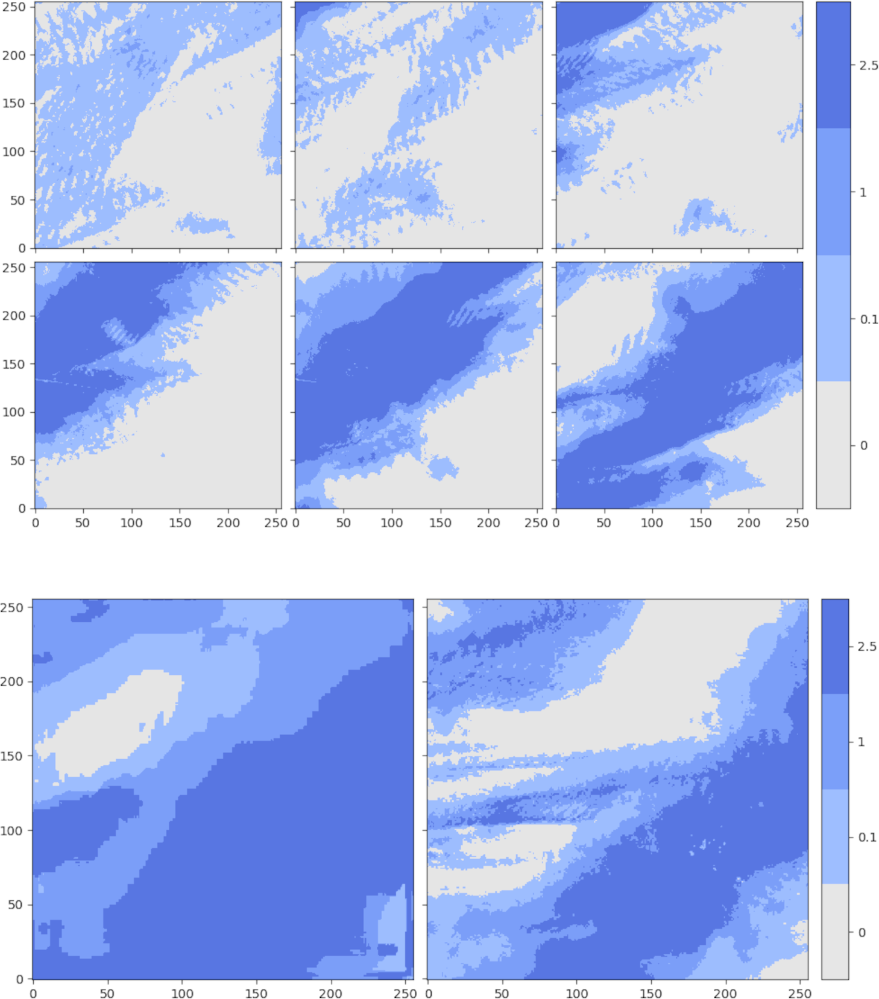
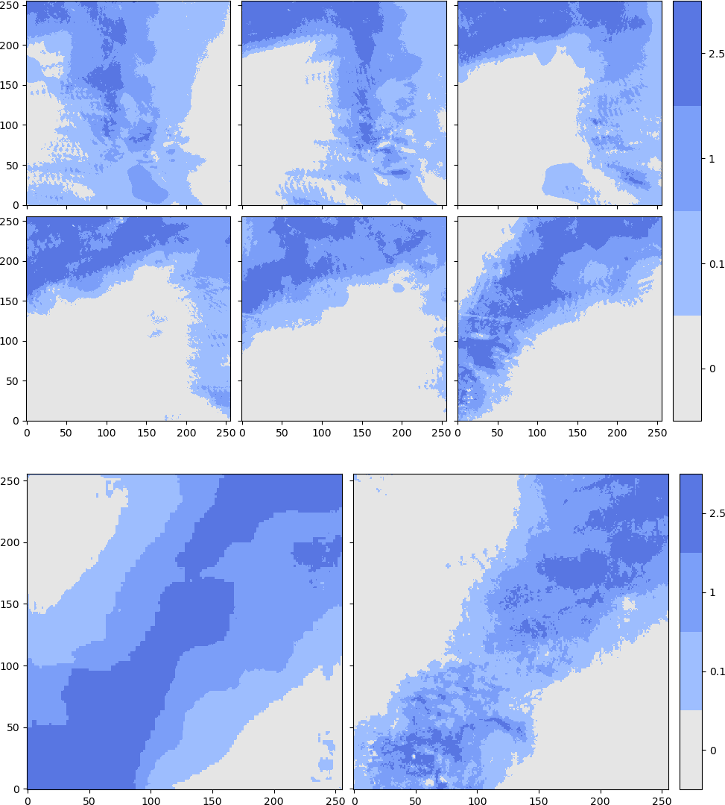

# Precipitation Nowcasting: a Deep Learning Approach

*A U-Net for 1h cumulative precipitation nowcasting over northern Germany using data from the German Weather Service (DWD)*

This project is inspired by the Google-Research paper ["Machine Learning for Precipitation Nowcasting from Radar Images"](https://arxiv.org/abs/1912.12132) and the relative blog post ["Using Machine Learning to "Nowcast" Precipitation in High Resolution"](https://ai.googleblog.com/2020/01/using-machine-learning-to-nowcast.html)

**Update [12.5.2024]** Deprecated version. I'm working on rewriting it and retraining it in a private repo.

### 2020-02-09 19:50

----
----
### 2021-03-11 01:50

*6 inputs (1h spacing, 1h cumulative) 1 output, ground truth in the lower right corner in each image. Prediction in the lower left corner. 4 classes, mm/h.*

## Description

This is a U-Net for quasi-image prediction. The architecture, based on the paper mentioned above, incorporates long-range and short-range skip connections, convolutions and batch-normalization.


One input frame is made of 5 concatenated channels:
- precipitation (1h cumulative data)
- longitude
- latitude
- normalized time-of-day
- normalized day-of-year


6 frames are taken as input for times t-5h, t-4h, t-3h, t-2h, t-1h and t. The output frame is made up only of the precipitation channel which is binned and not continuous as the input.

The bins of the output at t+1h are (in mm/h):
 - [0, 0.1)
 - [0.1, 1)
 - [1, 2.5)
 - [2.5, $\infty$)

The collection is made of
- 6 input frames
- 1 ground truth
is called a scene and the timestamp for the entire scene is t-5h.)


The area of interest is a square of 256km x 256km over northern Germany covering Bremen, Hamburg, Hanover and Magdeburg. The orography is considerably flat.


The data is provided for free by the German Weather Service as produced by the [Radar Online Calibration (RADOLAN)](https://www.google.com/search?client=firefox-b-lm&q=radolan) routine. The opendata server is accessible at [https://opendata.dwd.de/](https://opendata.dwd.de/) and the precipitation products (RW) are available at [https://opendata.dwd.de/climate_environment/CDC/grids_germany/hourly/radolan/historical/bin/](https://opendata.dwd.de/climate_environment/CDC/grids_germany/hourly/radolan/historical/bin/) and [https://opendata.dwd.de/climate_environment/CDC/grids_germany/hourly/radolan/recent/bin/](https://opendata.dwd.de/climate_environment/CDC/grids_germany/hourly/radolan/recent/bin/)

## Installation

To install this package first clone it in a local repository with git

```
git clone https://github.com/Campostrini/dwd_dl.git
```

Create a conda environment and install the requirements. This could fail due to the pytorch installation being heavily dependent on your machine
```
conda env create -n meteo -f requirements.yml
```
and activate the environment:
```
conda activate meteo
```

Alternatively, you can use docker by building an image using the Dockerfile.

To use a CUDA device with docker follow [this guide](https://docs.nvidia.com/datacenter/cloud-native/container-toolkit/install-guide.html) or [this guide](https://blog.roboflow.com/nvidia-docker-vscode-pytorch/#installing-docker-for-machine-learning)

go with

```
distribution=$(. /etc/os-release;echo $ID$VERSION_ID) \
      && curl -fsSL https://nvidia.github.io/libnvidia-container/gpgkey | sudo gpg --dearmor -o /usr/share/keyrings/nvidia-container-toolkit-keyring.gpg \
      && curl -s -L https://nvidia.github.io/libnvidia-container/$distribution/libnvidia-container.list | \
            sed 's#deb https://#deb [signed-by=/usr/share/keyrings/nvidia-container-toolkit-keyring.gpg] https://#g' | \
            sudo tee /etc/apt/sources.list.d/nvidia-container-toolkit.list
```

and

```
sudo apt-get update
sudo apt-get install -y nvidia-docker2
sudo systemctl restart docker
```

Test the installation with

```
docker run --rm --gpus all nvidia/cuda:11.0.3-base-ubuntu20.04 nvidia-smi
```

Let's build the docker image for the project
```
docker build -t meteo_image .
```

Check that the image is available 
```
docker images
```

Run the image
```
docker run -v $HOME/dwd_dl/:/home/dwd_dl/ --gpus all -t -d meteo_image
```
Check that the container with the image is running with
```
docker ps
```
And use the container name to open a terminal in it
```
docker exec -it <container_name> /bin/bash
```
Look at the `nvidia-smi` output to see if everything is running correctly
```
nvidia-smi
```

If you're not running it inside docker, add the project directory to `PYTHONPATH`.

## Training
It is assumed one is using docker.

When you first run the training routine, a new hidden directory will be created with a RADOLAN_FCFG.yml file. It contains various configuration settings. 

```
python /home/dwd_dl/dwd_dl/lightning-train.py
```

`CTRL+C` to stop.

Navigate to `~/.radolan_config` and edit the `RADOLAN_CFG.yml`

The script also produces 5 files of the kind `*_RANGES.yml`. These contain the date ranges for the training, validation and test set. Modify them as you please. Beware that all the ranges should not fall outside the ranges in `DATE_RANGES.yml`. The ranges should be a list of lists in `.yml` format. Overlapping ranges will throw Exceptions.
```
- - YYYY-MM-DD hh:mm:ss
  - YYYY-MM-DD hh:mm:ss
```
Extrema are included and you should only use timestamps with `mm:ss` set to `50:00` as that is what the RADOLAN routine outputs.

`VIDEO_RANGES.yml` contains the ranges used for a video of prediction output vs. ground truth if it's requested by the user.

For the various options run
```
python /home/dwd_dl/dwd_dl/lightning-train.py --help
```
## Logging

Logs are automatically saved in `~/Radolan/tt_logs/`. To visualize them publish the `6006` port to the host with the `-p` flag when invoking `docker run`.

```
docker run -v $HOME/dwd_dl/:/home/dwd_dl/ --gpus all -p 6006:6006 -t -d meteo_image
```
So that, after opening a terminal in the docker container where the logs are stored, you can run
```
tensorboard --logdir=/path/to/tt_logs/
```
and access the tensorboard dashboard on your browser at `localhost:6006`.

If you're accessing tensorboard running on docker on a remote machine use `--host 0.0.0.0`.

## Weights and Visualization

The model weights described in the thesis were obtained by training only in winter (October-April). Training, Validation and Testing were divided as follows:

|          | Training | Validation | Testing |
| ---------| :--------: | :----------: | :-------: |
|  Start | 1.10.05  | 1.1.18 | 1.1.20 |
| End    | 31.12.17 | 31.12.19 | 31.12.21 |

Make sure you a directory was created at `~/.radolan_config/`.
To adopt the same training, validation and testing ranges use the script `dwd_dl/resources/adopt_complete_winter.sh` in the project's repository.

To use the weights you have to clone the weights repo from github and download them with `git lfs`.

```
git clone https://github.com/Campostrini/dwd_dl_weights.git
```
Install `git lfs` following [this guide](https://github.com/git-lfs/git-lfs/blob/main/INSTALLING.md) and the run
```
git lfs pull
```
to download the weights.

Now you can run the container, remember to bind the volume with the weights
```
docker run -v $HOME/dwd_dl/:/home/dwd_dl/ -v $HOME/dwd_dl_weights/:/home/weights/ --gpus all -p 7777:7777 -t -d meteo_image 
```
access it
```
docker exec -it <container_name> /bin/bash
```
and run the visualizer
```
python /home/dwd_dl/dwd_dl/visualize.py --model_path /home/weights/2205101547-epoch\=09-valid_loss\=0.00.ckpt --address 0.0.0.0
```

## Weaknesses and Possible Improvements

The model can architecturally be drastically improved. Much of the architecture was taken from ["Machine Learning for Precipitation Nowcasting from Radar Images"](https://arxiv.org/abs/1912.12132) and the relative blog post ["Using Machine Learning to "Nowcast" Precipitation in High Resolution"](https://ai.googleblog.com/2020/01/using-machine-learning-to-nowcast.html). Some choices they made don't seem canonical and the code is not openly available. Further, GANs and RRNs seem to have had more success recently compared to UNet when it comes to weather prediction.

In the training process a bottleneck is probably present in retrieving files from disk even with dask.

16-bit precision will make training drastically faster. Although cross entropy with weights seems to have some issues with the types of the weights. I found this to be machine-dependent though.

Assessing the performance with other time-frames and other variables is just a matter of adding them, this will probably have a positive result on the final precipitation prediction.

Weights seem to steer the model to over-prediction of higher precipitation classes.

## TODO

- [ ] Simplify installation procedure
- [ ] Add Extensive Tests
- [ ] Add Further documentation
- [ ] General refactoring
- [ ] Solve probable bottleneck
- [ ] Solve concurrency issues with dask and multiple pytorch workers
- [ ] Create simple Flask server for deployment
